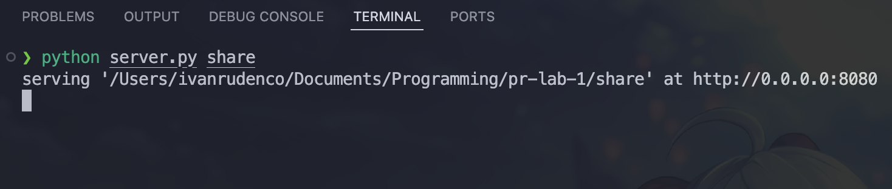
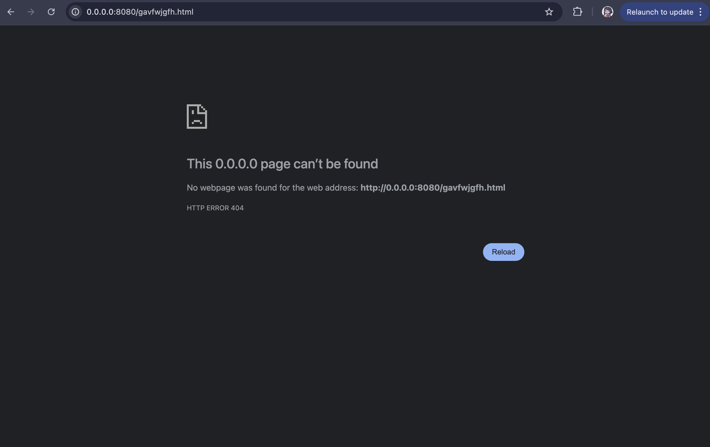
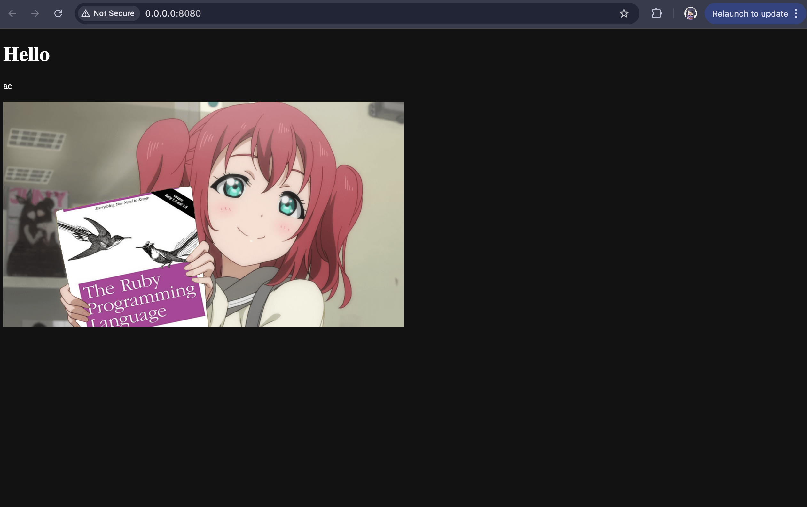
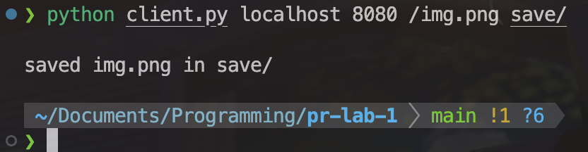

# HTTP File Server with TCP Sockets

### Course: Computer Networks

### Author: Rudenco Ivan

---

### Contents of the source directory
- `share`: folder served by the server
- `server.py`: server code
- `client.py`: client code

### Docker compose file

### Starting the container

### Starting the server
Run `python server.py share`

### Contents of the served directory
- `nested`: nested folder for bonus task
- `index.html`
- `img.png`
- `doc.pdf`

### Requests of files in the browser
- Nonexistent file:

- HTML file with image:

- PDF file:

- PNG file:

### Client and saving files (bonus point)
Running the client:

`img.png` is saved into `save`:

### Directory listing (bonus point)
Directory listing:

Nested directory listing:
